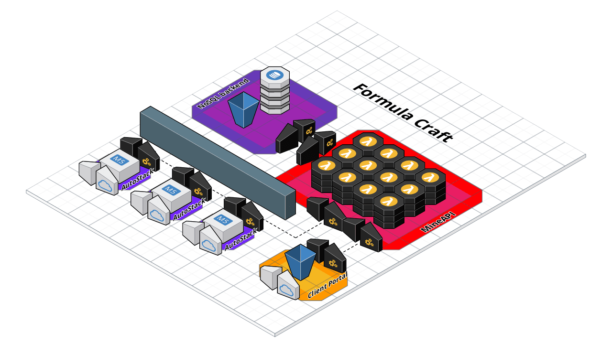

# FormulaCraft
A Proof of Concept project for running Minecraft servers on AWS.

## Project Summary

The public cloud affords on demand compute power. This can be utilized by hosting providers to offer more granular payment options, as you **pay by the hour or by the second**.

This will serve an **under-represented community of casual gamer groups**, who will operate servers for low and sporadic time intervals. Current hosting providers typically offer a monthly subscription, with limited provisions for raising or lowering your capacity; but no hourly or even daily subscription options. This leads to idle servers and wasted resources.

# Built With
- [node.js](https://nodejs.org/en/) - The server backend framework.
- [child_process](https://nodejs.org/api/child_process.html) - The MC Server monitoring used.
- [AWS CloudFormation](https://aws.amazon.com/cloudformation/) - IaaS. For programmatic resource partitioning.
- [AWS S3 web hosting](https://docs.aws.amazon.com/AmazonS3/latest/dev/WebsiteHosting.html) - Hosting the Client Portal.
- [Creative Tim](https://www.creative-tim.com/product/material-dashboard-pro-react) - The front-end style framework.
- [AWS Lambda & API Gateway](https://aws.amazon.com/api-gateway/) - The interaction layer API.
- [Cloudcraft](https://cloudcraft.co/) - Visual AWS representations.

# Versioning

- (complete January, 2020) Version 1 is a proof of concept. Minimal client-side functionality or optimizations.
- (TBD) Version 2 is a tuning update. Focus will be as follows:
  - Stack partitioning. More efficient resource partitioning.
  - Client Portal redesign. A more intuitive approach allowing for more features in future updates.
  - CI/CD definitions.
- (TBD) Version 3 is a features update. Focus will be as follows:
  - User quality of life changes.
  - Mod compatability and availability.
  - distributable software.
- (TBD) Version 4 is a marketing update. At this point, the project will likely be sold or monetized.

# Authors

- Brendan Carlquist
- Nathan Lipiarski
- (past contributor) Austin Quach
- (onboarding) Oliver Kou

# terminology
- **FormulaCraft-** the project name. A Proof of Concept project for running Minecraft servers on AWS.
- the project is loosely categorized into two codebases, *FormulaStack* and *AutoStack*. One goal of the project is to utilize IaaS heavily, and allow deployment of each part of the infrastructure using CloudFormation.
- **FormulaStack-** *FormulaCraft* is the interaction and integration component, and it consists of a few different interactive portals (website, discord integration, etc) as well as a integrative API built with AWS's Lambda and API Gateway.
- **AutoStack-** *AutoStack* handles the infrastructure on AWS for each request of playtime on a server. This is the "core technology" of the project, consisting of automated infrastructure partitioning as well as a node.js wrapper program for Minecraft.
